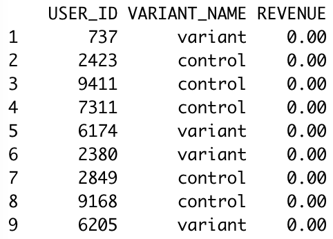
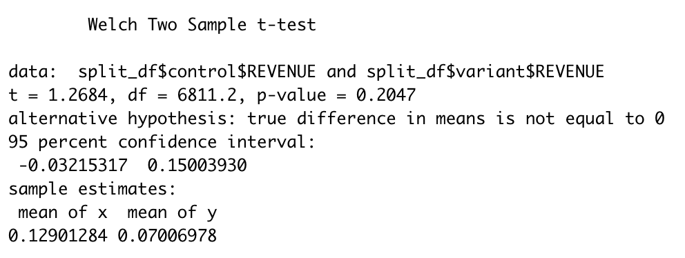

# AB-testing
Used R to compare revenues between a control and treatment group

## Overview

This project performs a two-sample t tests on [data](https://www.kaggle.com/datasets/sergylog/ab-test-data) posted on Kaggle.com. The data is comprised of the revenues made by employees. The employees were split between a control and treatment group. The goal is to determine if the treatment group, also referred to as the "variant" group, performed differently from control group.

Below is a sample of the dataset. Note that the revenue of some employees is 0. The column "VARIANT_NAME" determines which group the employee is in.

## Results

The results of the t-test are shown below. The p-value is 0.2047, which is greater than the cut-off value of 0.05. Therefore, we fail to reject the null, meaning any difference between the control and treatment group is likely due to chance.

